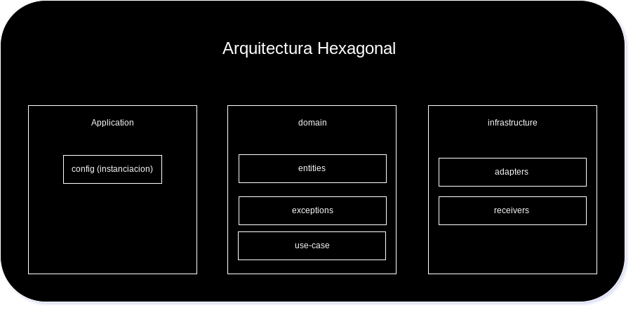

# nodejs-apirest-app

## Diagrama de arquitectura

Microservicio creado con arquitectura hexagonal, principal división de carpetas 'application', 'domain', 'infrastructure'.

- __'application':__ inicializamos los componentes principales de dominio e infraestructura ademas de las configuraciones necesarias para el proyecto.

- __'domain':__ las entidades de dominio, los casos de uso y las posibles excepciones provenientes del dominio.

- __'infrastructure':__ conexiones a bases de datos, servidores web, message broker entre otros componentes de entrada ('receivers') y salida('adapters') de datos.



## Run container Postgresql

```bash
$docker run --rm --name my-postgres -e PGDATA=/pgdata -e POSTGRES_PASSWORD=passwordapp -e POSTGRES_USER=userapp -e POSTGRES_DB=app -p 5432:5432 postgres:16.2
```

Ingresar al contenedor

```bash
$docker exec -it my-postgres bash

$psql -d app -U userapp
```

Crear la tabla

```sql
CREATE TABLE IF NOT EXISTS users (
    user_id SERIAL PRIMARY KEY,
    user_username VARCHAR(50) NOT NULL,
    user_password VARCHAR(255) NOT NULL
);
```

CREATE TABLE IF NOT EXISTS users ( user_id SERIAL PRIMARY KEY, user_username VARCHAR(50) NOT NULL, user_password VARCHAR(255) NOT NULL);
